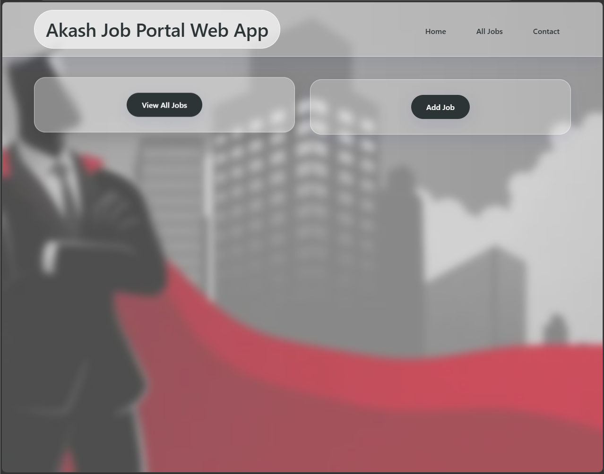
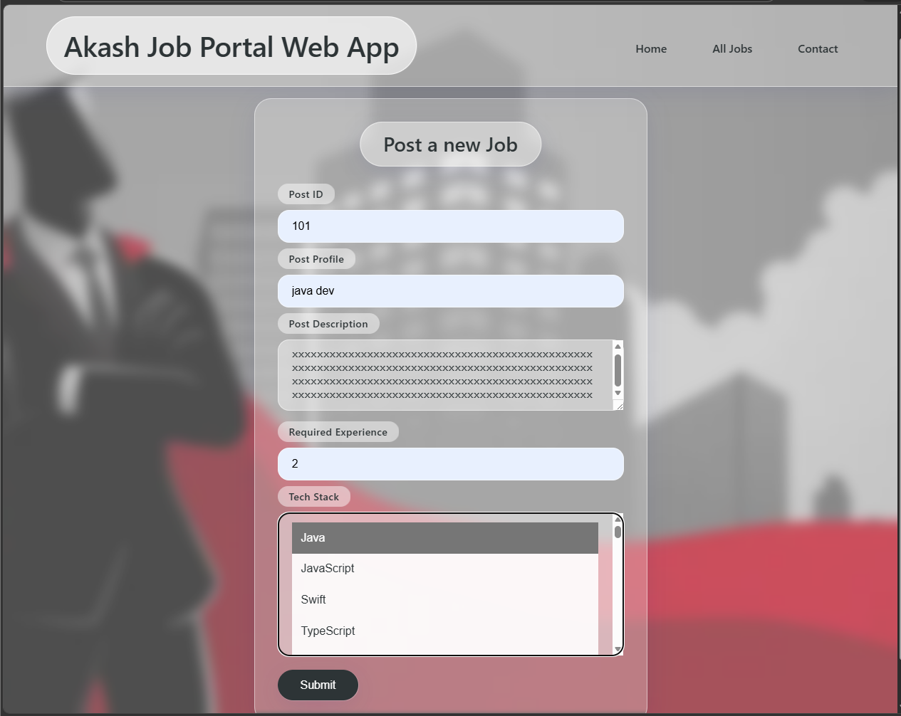
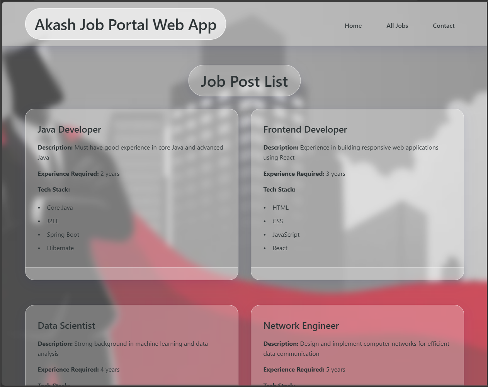
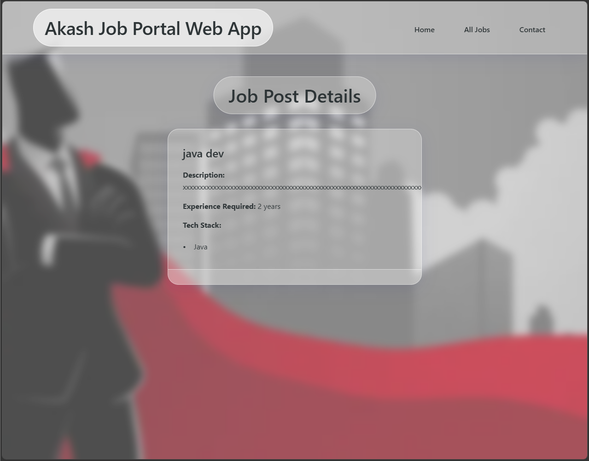

# 🚀 SpringBoot Job Application Portal


---

## 📋 Table of Contents
- [Project Overview](#-project-overview)
- [Architecture](#-architecture)
- [Features](#-features)
- [Tech Stack](#-tech-stack)
- [Screenshots](#-screenshots)
- [Installation](#-installation)
- [Usage](#-usage)
- [Project Structure](#-project-structure)
- [API Endpoints](#-api-endpoints)
- [Future Enhancements](#-future-enhancements)
- [Contributing](#-contributing)
- [License](#-license)
- [Author](#-author)

---

## 🎯 Project Overview

**SpringBoot Job Application Portal** is a robust, enterprise-grade web application designed to streamline job posting and management. Built with modern Java technologies, this project serves as a comprehensive demonstration of backend development best practices and MVC architecture.

### ✨ What Makes This Project Special?
- 🏗 **Clean Architecture**: Perfect separation of concerns with Controller → Service → Repository layers
- 📝 **Dynamic JSP Pages**: Server-side rendering with JSP and JSTL
- 🎨 **Responsive Design**: Beautiful, mobile-friendly interface with custom CSS
- 💾 **In-Memory Data Management**: Efficient data handling without database complexity
- 🔧 **Production-Ready**: Built with Spring Boot best practices

---

## 🏗 Architecture

```
┌─────────────────┐     ┌─────────────────┐     ┌─────────────────┐     ┌─────────────────┐
│                 │     │                 │     │                 │     │                 │
│   Controller    │────▶│    Service      │────▶│   Repository    │────▶│     Model       │
│   (Web Layer)   │     │  (Business)     │     │  (Data Layer)   │     │   (Entity)      │
│                 │     │                 │     │                 │     │                 │
└─────────────────┘     └─────────────────┘     └─────────────────┘     └─────────────────┘
         │                      │                        │                        │
         │                      │                        │                        │
         ▼                      ▼                        ▼                        ▼
    HTTP Requests         Business Logic           Data Management           JobPost Entity
    Response Handling     Validation               CRUD Operations            Fields & Methods
```

### 📐 Architectural Layers

| Layer | Responsibility | Key Components |
|-------|---------------|-----------------|
| **Controller** | HTTP Request Handling | `@Controller`, `@RequestMapping` |
| **Service** | Business Logic | `@Service`, Business Validation |
| **Repository** | Data Management | `@Repository`, In-Memory Storage |
| **Model** | Data Structure | POJOs, Entity Classes |

---

## ✨ Features

### ✅ Implemented Features
| Feature | Description | Status |
|---------|-------------|--------|
| 📝 **Add Job Post** | Create new job listings with detailed information | ✅ Complete |
| 📋 **View All Jobs** | Browse all available job postings | ✅ Complete |
| 🔍 **Job Details** | View comprehensive job information | ✅ Complete |
| 🎯 **Form Handling** | Robust form submission with validation | ✅ Complete |
| 🎨 **Glass Morphism UI** | Modern, minimalist design with blur effects | ✅ Complete |
| 📱 **Responsive Design** | Mobile-first approach, works on all devices | ✅ Complete |

### 🚀 Coming Soon
| Feature | Expected Version |
|---------|-----------------|
| 🔐 User Authentication | v2.0 |
| 🗄 MySQL Database Integration | v2.0 |
| 📊 Admin Dashboard | v2.1 |
| 🔍 Search & Filter Jobs | v2.1 |
| 📎 Resume Upload | v2.2 |
| 📧 Email Notifications | v2.2 |

---

## 💻 Tech Stack

### Backend
| Technology | Version | Purpose |
|------------|---------|---------|
|  | 17 | Core Programming Language |
|  | 3.1.5 | Application Framework |
|  | 6.0 | Web Layer Framework |
|  | 3.9 | Build & Dependency Management |
|  | 3.0 | View Technology |
|  | 2.0 | Tag Library |

### Frontend
| Technology | Purpose |
|------------|---------|
|  | Page Structure |
|  | Styling & Animations |
|  | Interactivity |

### Tools & IDE
| Tool | Purpose |
|------|---------|
|  | Primary IDE |
|  | Version Control |
|  | API Testing |

---

## 📸 Screenshots

### 🏠 Home Page
*Clean, minimalist home page with glass morphism design*


### ➕ Add Job Form
*Intuitive job posting form with comprehensive fields*


### 📄 Job List Page
*Beautiful card-based job listing display*


### 🔍 Job Details
*Detailed view of individual job postings*


> 📌 **Note**: Place your screenshots in an `images` folder at the root of your repository.

---

## 🔧 Installation

### Prerequisites
- ✅ JDK 17 or higher
- ✅ Maven 3.9+
- ✅ Git
- ✅ Your favorite IDE (IntelliJ recommended)

### Step-by-Step Setup

```bash
# 1️⃣ Clone the repository
git clone https://github.com/yourusername/SpringBoot-JobApp-Portal.git

# 2️⃣ Navigate to project directory
cd SpringBoot-JobApp-Portal

# 3️⃣ Build the project
mvn clean install

# 4️⃣ Run the application
mvn spring-boot:run

# 5️⃣ Access the application
# Open browser and navigate to:
http://localhost:8083
```

### Docker Support (Coming Soon)
```bash
# Build Docker image
docker build -t job-portal .

# Run container
docker run -p 8083:8083 job-portal
```

---

## 📖 Usage

### 📝 Adding a Job Post
1. Navigate to **Home Page**
2. Click on **"Add Job"** card
3. Fill in the job details:
   - Post ID (unique identifier)
   - Post Profile (job title)
   - Post Description
   - Required Experience (years)
   - Tech Stack (multiple select)
4. Click **Submit** to save

### 📋 Viewing All Jobs
- Click **"View All Jobs"** on the navbar or home page
- Browse through all available job postings
- Each job displays in a beautiful card format

### 🔍 Job Details
- Click on any job card to view detailed information
- See complete job description, requirements, and tech stack

---

## 📁 Project Structure

```
📦 SpringBoot-JobApp-Portal
├── 📂 src
│   ├── 📂 main
│   │   ├── 📂 java
│   │   │   └── 📂 com/akash/app
│   │   │       ├── 📂 controller
│   │   │       │   └── 📄 JobController.java
│   │   │       ├── 📂 service
│   │   │       │   └── 📄 JobService.java
│   │   │       ├── 📂 repository
│   │   │       │   └── 📄 JobRepository.java
│   │   │       └── 📂 model
│   │   │           └── 📄 JobPost.java
│   │   └── 📂 webapp
│   │       ├── 📂 WEB-INF
│   │       │   └── 📂 views
│   │       │       ├── 📄 home.jsp
│   │       │       ├── 📄 addjob.jsp
│   │       │       ├── 📄 jobdetails.jsp
│   │       │       └── 📄 viewalljobs.jsp
│   │       └── 📂 resources
│   │           ├── 📄 style.css
│   │           └── 📄 style1.css
├── 📄 pom.xml
└── 📄 README.md
```

---

## 🌐 API Endpoints

| Endpoint | Method | Description | View |
|----------|--------|-------------|------|
| `/home` | GET | Home page | `home.jsp` |
| `/addjob` | GET | Add job form | `addjob.jsp` |
| `/handleForm` | POST | Process job submission | Redirect |
| `/viewalljobs` | GET | List all jobs | `viewalljobs.jsp` |
| `/jobdetails` | GET | View job details | `jobdetails.jsp` |

---

## 🎓 Concepts Covered

### Spring Core
- 🔹 Dependency Injection
- 🔹 Inversion of Control (IoC)
- 🔹 Auto Configuration

### Spring MVC
- 🔹 `@Controller` & `@RequestMapping`
- 🔹 `@ModelAttribute` for form binding
- 🔹 View Resolvers
- 🔹 JSP with JSTL

### Architecture
- 🔹 Layered Architecture
- 🔹 Separation of Concerns
- 🔹 Service Layer Pattern
- 🔹 Repository Pattern

---

## 🚀 Future Enhancements

### Phase 2 - Database Integration
- [ ] MySQL database connection
- [ ] JPA/Hibernate implementation
- [ ] CRUD repository operations
- [ ] Query methods

### Phase 3 - Security
- [ ] Spring Security implementation
- [ ] User registration/login
- [ ] Role-based access control
- [ ] OAuth2 integration

### Phase 4 - Advanced Features
- [ ] RESTful API endpoints
- [ ] File upload (resumes)
- [ ] Email notifications
- [ ] Search & filter functionality
- [ ] Pagination for job listings
- [ ] Admin dashboard

---

## 🤝 Contributing

Contributions are welcome! Here's how you can help:

1. 🍴 Fork the repository
2. 🌿 Create your feature branch (`git checkout -b feature/AmazingFeature`)
3. 💾 Commit your changes (`git commit -m 'Add some AmazingFeature'`)
4. 📤 Push to the branch (`git push origin feature/AmazingFeature`)
5. 🎯 Open a Pull Request

### Contribution Guidelines
- Write clear commit messages
- Add comments to your code
- Update documentation as needed
- Test your changes thoroughly

---

## 📄 License

This project is licensed under the MIT License - see the [LICENSE](LICENSE) file for details.

```
MIT License

Copyright (c) 2024 Akash Samanta

Permission is hereby granted, free of charge, to any person obtaining a copy
of this software and associated documentation files...
```

---

## 👨‍💻 Author

### **Akash Samanta**
*Java Backend Developer | Spring Boot Specialist*


| Platform | Link |
|----------|------|
| 💼 **LinkedIn** | [Connect with me](https://linkedin.com/in/yourprofile) |
| 🐱 **GitHub** | [Follow me](https://github.com/yourusername) |
| 📧 **Email** | [akash.samanta@email.com](mailto:akash.samanta@email.com) |
| 🌐 **Portfolio** | [akashsamanta.dev](https://akashsamanta.dev) |

### 🏆 Skills


---

## 🙏 Acknowledgments

- 📚 Spring Boot Documentation
- 🎨 Unsplash for background images
- 👥 Community contributors
- ⭐ Everyone who starred this repository

---

## 📊 Project Status


---

<div align="center">

### ⭐ If you found this project helpful, give it a star!

[](https://github.com/yourusername/SpringBoot-JobApp-Portal/stargazers)
[](https://github.com/yourusername/SpringBoot-JobApp-Portal/network/members)

**Built with ❤️ by Akash Samanta**

</div>
```
